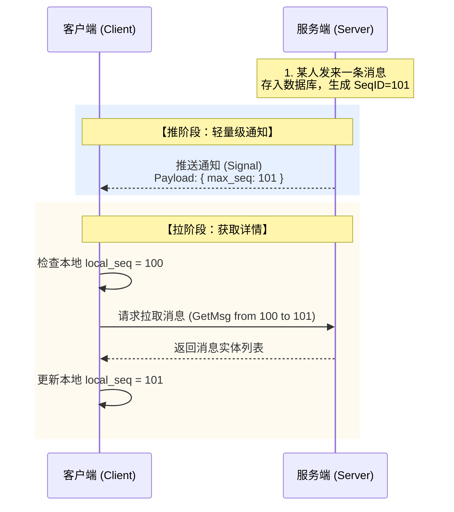
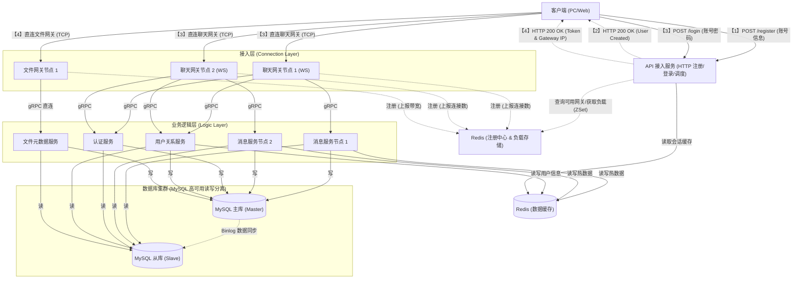
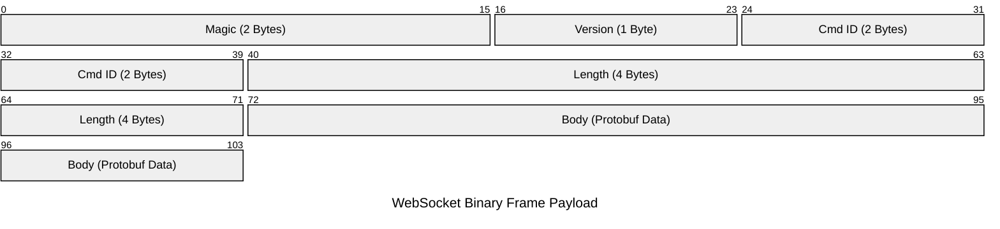
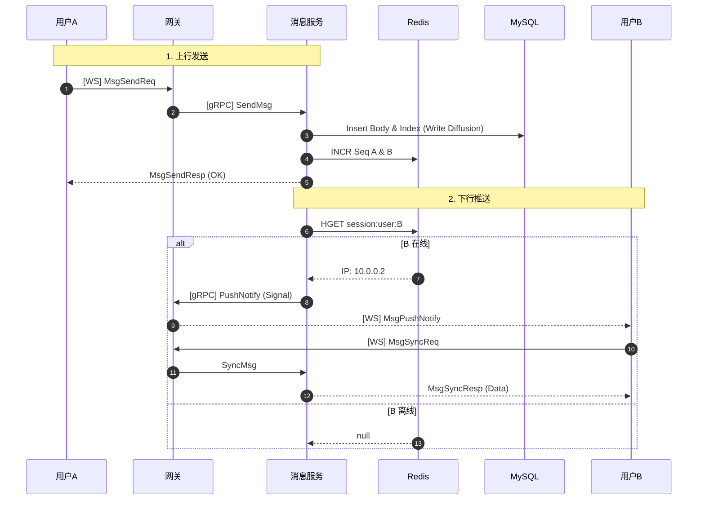

# 项目背景与任务

## 明确任务

设计一个学习用的 IM 即时通信项目（模仿微信）的服务器端，可以支持实时通信、多端同步、离线消息拉取、历史消息存储、单聊、群聊、加好友、加群聊、文件传输功能、心跳保活、单服踢人、跨服踢人。同时服务器端架构使用微服务框架并实现高可用、负载均衡。

## IM 核心概念

- **用户**：系统的使用者。
    
- **消息**：指用户之间的沟通内容。在我们的 IM 系统中，只实现文本消息的传输。
    
- **会话**：通常指两个用户之间因聊天而建立起的关联。
    
- **群**：通常指多个用户之间因聊天而建立起的关联。
    
- **终端**：指用户使用 IM 系统的机器。我们的 IM 系统中只供给 PC 端和 Web 端。
    
- **未读数**：指用户还没读的消息数量。
    
- **用户状态**：指用户当前是在线、离线还是挂起等状态。
    
- **关系链**：指用户与用户之间的关系，设有单向好友（单删）、双向好友、群聊关系。
    
- **单聊**：一对一聊天。
    
- **群聊**：多人聊天。
    
- **信箱**：指一个 Timeline、一个收发消息的队列。
    

## 技术栈限定

- **语言标准**：C++17/20 (注意协程的使用)
    
- **核心库**：
    
    - **Boost.Asio**: 异步网络编程
        
    - **Boost.Beast**: HTTP 和 WebSocket 协议实现
        
    - **gRPC / Protobuf**: 微服务间的高性能 RPC 通信
        
- **基础设施**：
    
    - **容器化**: Docker, Docker Compose
        
    - **数据库**: MySQL 8.0 (主从架构)
        
    - **缓存/中间件**: Redis 7.0 (承担缓存与简单的服务发现)
        
    - **日志库**: spdlog
        

# 消息模型决策

在 IM 系统设计中，消息模型被拆解为两个独立的维度：

1. **消息存储模型**：解决数据**在服务端怎么存**的问题。
    
2. **消息同步模型**：解决数据**如何传输给客户端**的问题。
    

## TimeLine 模型

**定义**：Timeline 是消息系统的核心逻辑抽象，本质上是一个**拥有单调递增序列号的消息队列**。 ![[IM即时通信服务器端架构-1766462773130.png]]

**核心特性**：

1. **顺序 ID (Sequence ID)**：每条消息拥有唯一的、单调递增的序列号，作为同步凭证。
    
2. **永远追加 (Append Only)**：新消息永远插入队尾，客户端只需记录 `local_max_seq` 防止漏拉。
    
3. **随机定位与范围读取**：支持根据 SeqID 定位并拉取 N 条数据。
    

## 消息存储模型

### 读扩散

发送者发送消息时，只存一份在发送者的发件箱。接收者上线时查询所有好友/群组的信箱。

- **优点**：写操作轻量，节省空间。
    
- **缺点**：读操作极重，聚合查询效率低。
    

### 写扩散—— 本项目采用

![[image/IM即时通信服务器端架构-1766418502950.png]] 每个用户都有独立的**收件箱 (Timeline)**。有人在群里发消息时，服务器将消息引用（ID）复制并插入到**所有成员**的收件箱中。

- **优点**：读取速度极快，只需查自己的 Timeline，逻辑简单。
    
- **缺点**：写入放大（万人群压力大），存储空间消耗大。
    
- **决策理由**：IM 是读多写少场景，用空间换时间。通过限制群人数（如 500 人）规避极端写放大。
    

## 消息同步模型

### 推拉结合——本项目采用

![[IM即时通信服务器端架构-1766454717526.png]]

1. **推 (Notify)**：有新消息时，服务器通过 WebSocket 仅推送一个**通知信号**（包含 `latest_seq`）。
    
2. **拉 (Pull)**：客户端收到信号，对比本地数据，主动发起请求**拉取**完整的消息列表。
    

代码段



**优点**：

- **不丢消息**：即使通知丢失，下次心跳或重连时携带 `local_seq` 比对即可拉回。
    
- **有序性**：严格按 SeqID 拉取。
    
- **节省流量**：合并请求，避免无效轮询。
    

# 系统架构设计

## 架构拓扑图

代码段



## 微服务划分

### 核心调度与接入层

- **API 接入/调度服务 (Dispatch Service)**
    
    - **协议**: HTTP
        
    - **职责**: 注册、登录、根据负载均衡算法分配 `Chat Gateway` IP。
        
- **聊天接入网关 (Chat Gateway)**
    
    - **协议**: WebSocket (Protobuf)
        
    - **职责**: 连接鉴权、长连接持有、心跳检测、信令转发（WS转gRPC）、消息推送出口。
        
- **文件传输网关 (File Gateway)**
    
    - **协议**: TCP (Custom Binary)
        
    - **职责**: 大文件流式传输、零拷贝转发、限流。
        

### 业务逻辑层 (Logic Layer)

- **认证服务 (Auth Service)**: 登录鉴权、生成 Token、踢人逻辑。
    
- **用户关系服务 (User Service)**: 个人资料、好友关系链、黑名单。
    
- **消息信箱服务 (Message Service)**: **核心**。ID 生成、写扩散落地、推送路由、离线拉取。
    
- **文件元数据服务 (File Meta Service)**: 文件任务管理、秒传检测、断点记录。
    

## 高可用与负载均衡策略

### 负载均衡 (LB)

1. **接入层 LB (Dispatch Service)**:
    
    - **聊天网关**: 最小连接数策略 (Least Connections)。通过 Redis ZSet 存储网关在线人数，分配最空闲的节点。
        
    - **文件网关**: 一致性哈希 (Consistent Hashing)。保证同一文件的分片上传至同一节点，利用本地缓存。
        
2. **服务层 LB**: gRPC 客户端 DNS 轮询。
    

### 容灾 (HA)

- **节点容灾**: 服务启动向 Redis 注册并维持心跳 (TTL)。宕机后 Key 过期，调度服务自动剔除。
    
- **存储容灾**: MySQL 主从读写分离；Redis 单体（生产环境建议 Cluster/Sentinel）。
    

### 状态路由 (Session Routing)

通过 **Redis 全局会话表** (`session:user:{uid}`) 记录用户所在的网关 IP，实现精准推送。

# 数据库设计

## 1. MySQL 表结构设计

### A. 用户与关系模块

```SQL
CREATE TABLE `im_user` (
  `user_id` BIGINT UNSIGNED NOT NULL AUTO_INCREMENT COMMENT '用户唯一ID',
  `username` VARCHAR(32) NOT NULL DEFAULT '',
  `password` VARCHAR(128) NOT NULL DEFAULT '',
  `nickname` VARCHAR(64) NOT NULL DEFAULT '',
  `created_at` TIMESTAMP DEFAULT CURRENT_TIMESTAMP,
  PRIMARY KEY (`user_id`),
  UNIQUE KEY `uk_username` (`username`)
) ENGINE=InnoDB DEFAULT CHARSET=utf8mb4;

CREATE TABLE `im_relation` (
  `id` BIGINT UNSIGNED NOT NULL AUTO_INCREMENT,
  `user_id` BIGINT UNSIGNED NOT NULL COMMENT 'Owner',
  `friend_id` BIGINT UNSIGNED NOT NULL COMMENT 'Friend',
  `status` TINYINT NOT NULL DEFAULT 1 COMMENT '1-正常, 2-拉黑, 3-删除',
  `remark` VARCHAR(64) DEFAULT '',
  PRIMARY KEY (`id`),
  UNIQUE KEY `uk_user_friend` (`user_id`, `friend_id`),
  KEY `idx_friend_id` (`friend_id`)
) ENGINE=InnoDB DEFAULT CHARSET=utf8mb4 COMMENT='双向存储策略';
```

### B. 消息存储模块 (Timeline)

```SQL

-- 消息内容表 (全量存储，只存一份)
CREATE TABLE `im_message_body` (
  `msg_id` BIGINT UNSIGNED NOT NULL,
  `sender_id` BIGINT UNSIGNED NOT NULL,
  `group_id` BIGINT UNSIGNED NOT NULL DEFAULT 0,
  `msg_type` TINYINT NOT NULL DEFAULT 1,
  `msg_content` TEXT,
  `created_at` TIMESTAMP DEFAULT CURRENT_TIMESTAMP,
  PRIMARY KEY (`msg_id`),
  KEY `idx_sender` (`sender_id`)
) ENGINE=InnoDB DEFAULT CHARSET=utf8mb4;

-- 消息信箱表 (Timeline，写扩散)
CREATE TABLE `im_message_index` (
  `id` BIGINT UNSIGNED NOT NULL AUTO_INCREMENT,
  `owner_id` BIGINT UNSIGNED NOT NULL COMMENT '信箱所属用户',
  `msg_id` BIGINT UNSIGNED NOT NULL,
  `seq_id` BIGINT UNSIGNED NOT NULL COMMENT '逻辑时钟',
  `is_sender` TINYINT NOT NULL DEFAULT 0,
  `created_at` TIMESTAMP DEFAULT CURRENT_TIMESTAMP,
  PRIMARY KEY (`id`),
  UNIQUE KEY `uk_owner_seq` (`owner_id`, `seq_id`)
) ENGINE=InnoDB DEFAULT CHARSET=utf8mb4;
```

### C. 群组模块

```SQL
CREATE TABLE `im_group` (
  `group_id` BIGINT UNSIGNED NOT NULL AUTO_INCREMENT,
  `group_name` VARCHAR(64) NOT NULL,
  `owner_id` BIGINT UNSIGNED NOT NULL,
  PRIMARY KEY (`group_id`)
) ENGINE=InnoDB DEFAULT CHARSET=utf8mb4;

CREATE TABLE `im_group_member` (
  `id` BIGINT UNSIGNED NOT NULL AUTO_INCREMENT,
  `group_id` BIGINT UNSIGNED NOT NULL,
  `user_id` BIGINT UNSIGNED NOT NULL,
  `role` TINYINT DEFAULT 1,
  PRIMARY KEY (`id`),
  UNIQUE KEY `uk_group_user` (`group_id`, `user_id`)
) ENGINE=InnoDB DEFAULT CHARSET=utf8mb4;
```

### D. 文件任务模块

```SQL
CREATE TABLE `im_file_task` (
  `task_id` CHAR(36) NOT NULL,
  `user_id` BIGINT UNSIGNED NOT NULL,
  `file_md5` CHAR(32) NOT NULL DEFAULT '',
  `status` TINYINT NOT NULL DEFAULT 0,
  `storage_path` VARCHAR(512) NOT NULL DEFAULT '',
  PRIMARY KEY (`task_id`),
  KEY `idx_md5` (`file_md5`)
) ENGINE=InnoDB DEFAULT CHARSET=utf8mb4;
```

## 2. Redis 键值设计

- **会话路由**: `Hash` `im:session:{user_id}` -> `{gateway_ip, conn_fd}` (TTL: 心跳x2)
    
- **SeqID**: `String` `im:seq:{user_id}` (INCR)
    
- **用户信息**: `String` `im:user:{user_id}` (Protobuf/JSON, Cache Aside)
    

# 通信协议设计

## 1. 网络传输协议

全链路 WebSocket。在 Binary Frame 中嵌入自定义包头。

### 包结构

代码段



### C++ 包头定义

```cpp
#pragma pack(push, 1)
struct PacketHeader {
    char magic[2] = {'I', 'M'};
    uint8_t version = 1;
    uint16_t cmd_id = 0;
    uint32_t body_len = 0;
};
#pragma pack(pop)
```

## 2. 业务命令字 (CmdID)

```cpp
enum CommandID : uint16_t {
    CMD_LOGIN_REQ = 0x1001, CMD_LOGIN_RESP = 0x1002,
    CMD_HEARTBEAT_REQ = 0x1003, CMD_HEARTBEAT_RESP = 0x1004,
    CMD_MSG_SEND_REQ = 0x2001, CMD_MSG_SEND_RESP = 0x2002,
    CMD_MSG_PUSH_NOTIFY = 0x2003, 
    CMD_MSG_SYNC_REQ = 0x2004, CMD_MSG_SYNC_RESP = 0x2005,
    // ... 文件、好友、群组相关 ID
};
```

## 3. Protobuf 定义 (`im_protocol.proto`)

```Protocol Buffers
syntax = "proto3";
package im;

enum MsgType { TEXT = 0; IMAGE = 1; FILE = 2; SYSTEM = 3; FRIEND_REQ = 4; }

message MessageData {
    uint64 msg_id = 1;
    uint64 seq_id = 2;
    uint64 sender_id = 3;
    uint64 group_id = 5;
    MsgType type = 6;
    string content = 7;
}

// 登录 (WS 连接参数带 Token，此处仅作逻辑补全)
message LoginReq {
    uint64 user_id = 1;
    string token = 2;
    string device_id = 3;
}
message LoginResp { bool success = 1; string session_id = 4; }

// 心跳
message HeartbeatReq { uint64 user_id = 1; }
message HeartbeatResp { uint64 server_time = 1; }

// 消息业务
message MsgSendReq {
    uint64 receiver_id = 1;
    uint64 group_id = 2;
    MsgType type = 3;
    string content = 4;
}
message MsgSendResp { uint64 msg_id = 1; uint64 seq_id = 2; }

message MsgPushNotify { uint64 max_seq_id = 1; } // 推送信号

message MsgSyncReq { uint64 user_id = 1; uint64 local_max_seq = 2; uint32 limit = 3; }
message MsgSyncResp {
    uint64 max_seq = 1;
    repeated MessageData msgs = 2;
}
```

# API 接口设计 (Internal gRPC)

## 上下文包装

```Protocol Buffers
message ContextReq {
    uint64 user_id = 1;
    string client_ip = 3;
    string request_id = 4;
}
```

## 内部服务 (`im_internal.proto`)

```Protocol Buffers
service MsgService {
    rpc SendMsg(SendMsgInternalReq) returns (MsgSendResp);
    rpc SyncMsg(MsgSyncReq) returns (MsgSyncResp);
}
message SendMsgInternalReq { ContextReq ctx = 1; MsgSendReq msg_req = 2; }

// 反向 RPC: MsgService -> Gateway
service GatewayService {
    rpc PushNotify(PushNotifyInternalReq) returns (PushNotifyResp);
    rpc KickUser(KickUserInternalReq) returns (KickUserResp);
}
message PushNotifyInternalReq { uint64 user_id = 1; MsgPushNotify notify = 2; }
```

# 核心交互流程

## 1. 消息收发全链路 (单聊)



## 2. 好友申请 (Timeline 复用)

申请者发送请求 -> UserSvc 校验 -> 写入关系表 -> **调用 MsgSvc 发送 Type=FRIEND_REQ 的系统消息** -> 接收者收到推送 -> 拉取消息 -> 界面显示红点。

# 项目目录结构

```
im-server/
├── deploy/                 # Docker Compose, Configs
├── protos/                 # .proto files
├── src/
│   ├── common/             # 基础库 (Log, DB Pool, RPC Base)
│   ├── protocol/           # 生成的 PB 代码
│   ├── gateways/
│   │   ├── chat_gateway/   # WS Server
│   │   └── file_gateway/   # TCP Server
│   ├── services/
│   │   ├── auth_server/
│   │   ├── msg_server/     # 核心消息逻辑
│   │   ├── user_server/
│   │   └── file_meta_server/
│   └── dispatch/           # HTTP 调度服务
├── tests/                  # 单元测试与集成测试
└── CMakeLists.txt
```
