> 参考博客：

> https://xie.infoq.cn/article/19e95a78e2f5389588debfb1c

> https://cloud.tencent.com/developer/article/1525567

> https://mp.weixin.qq.com/s/fMF_FjcdLiXc_JVmf4fl0w

> https://help.aliyun.com/zh/tablestore/use-cases/message-system-architecture-in-the-modern-im-system?spm=a2c4g.11186623.help-menu-27278.d_3_4_3_0.314650ebLOfMET&scm=20140722.H_130781._.OR_help-T_cn~zh-V_1

# 项目背景与任务

## 明确任务

设计一个学习用的 IM 即时通信项目（模仿微信）的服务器端，可以支持实时通信、多端同步、离线消息拉取、历史消息存储、单聊、群聊、加好友、加群聊、文件传输功能、心跳保活、单服踢人、跨服踢人。同时服务器端架构使用微服务框架并实现高可用、负载均衡。

## IM 核心概念

- **用户**：系统的使用者。

- **消息**：是指用户之间的沟通内容。在我们的 IM 系统中，只实现文本消息的传输。

- **会话**：通常指两个用户之间因聊天而建立起的关联。

- **群**：通常指多个用户之间因聊天而建立起的关联。

- **终端**：指用户使用 IM 系统的机器。我们的 IM 系统中只供给 PC 端和 Web 端。

- **未读数**：指用户还没读的消息数量。

- **用户状态**：指用户当前是在线、离线还是挂起等状态。

- **关系链**：是指用户与用户之间的关系，我们的项目中设有单向的好友关系（单删）、双向的好友关系、群聊关系。这里需要注意与会话的区别，用户只有在发起聊天时才产生会话，但关系并不需要聊天才能建立。对于关系链的存储，可以使用图数据库（Neo4j 等等），可以很自然地表达现实世界中的关系，易于建模。当然在我们的项目中不会引入复杂的图数据库，只会使用MySQL 和 Redis。

- **单聊**：一对一聊天。

- **群聊**：多人聊天。

- **信箱**：指一个 Timeline、一个收发消息的队列。

## 技术栈限定

为了防止盲目的无止境的引入技术，必须在学习项目开始之前明确使用的技术栈。

- 语言标准： C++17/20。注意学习协程的使用。

- 核心库：

    - **Boost.Asio:** 异步网络编程。

    - **Boost.Beast:** HTTP 和 WebSocket 协议实现。

    - **gRPC / Protobuf:** 微服务间的高性能 RPC 通信。

- **基础设施**：

    - **容器化**：Docker, Docker Compose

    - **数据库:**

        - **主库:** MySQL 8.0

        - **从库:** MySQL 8.0

    - **缓存/中间件:**

        - **Redis:** Redis 7.0

        - **Etcd:** Etcd (服务发现)

    - **日志库**：spdlog

# 消息模型决策

在 IM 系统设计中，消息模型被拆解为两个独立的维度：

1. **消息存储模型**：解决数据**在服务端怎么存**的问题（数据库层）。

2. **消息同步模型**：解决数据**如何传输给客户端**的问题（网络层）。

## TimeLine 模型

**定义**：Timeline 是消息系统的核心逻辑抽象，本质上是一个**拥有单调递增序列号的消息队列**。所有的消息存储和同步（拉取）都依赖于这个模型。

![[IM即时通信服务器端架构-1766462773130.png]]

**核心特性**：

1. **顺序 ID (Sequence ID)**：

    - 每条消息都拥有一个唯一的、单调递增的序列号。

    - _作用_：这是客户端与服务端同步数据的凭证。

2. **永远追加 (Append Only)**：

    - 新消息写入时，系统自动分配比当前任何消息都大的 SeqID，确保永远插入队尾。

    - _作用_：保证客户端只需要记录一个 `local_max_seq`，大于这个值的全都是新消息，防止漏拉。

3. **随机定位与范围读取**：

    - 支持根据 SeqID 定位到队列的任意位置，并向后（或向前）拉取 N 条数据。

## 消息存储模型

**定义**：指消息数据在数据库表中的组织方式。

  

> **关注点**：**服务端内部**

> **核心问题**：一条消息产生后，在数据库里存几份？怎么存？

> **决定了**：**MySQL 表结构设计、磁盘占用、写入性能**。

### 读扩散


发送者发送消息时，系统只将消息存储在**发送者的发件箱**（或者群组的公共信箱）中，**写操作只发生一次**。

接收者（群成员）上线或查看消息时，需要主动去查询所有群组、好友的信箱，将消息拉取到本地。

  

**优点**：

- 写操作（发消息）很轻量，不管是单聊还是群聊，只需要往相应的信箱写一次就好了

- 每一个信箱天然就是两个人的聊天记录，可以方便查看聊天记录跟进行聊天记录的搜索

**缺点**：

- 读操作（读消息）很重

### 写扩散—— 本项目采用

![[image/IM即时通信服务器端架构-1766418502950.png]]

每个用户都有一个独立的**收件箱 (Timeline)**。

当有人在群里发消息时，服务器会将这就条消息的**引用（消息 ID）**复制并插入到**群内所有成员**的收件箱中。

  

**优点**：

- **读取速度极快**：用户上线时，只需要查自己的收件箱（Timeline），就能一次性拿到所有好友、所有群的最新消息，**只需要 1 次查询**。

    - **逻辑简单**：未读数计数器和消息同步逻辑非常容易实现。

- **缺点**：

    - **写入放大**：发消息时的 I/O 压力大。如果是万人大群，发一条消息会导致数据库/缓存瞬间产生一万次写入。

    - **存储空间消耗大**：虽然只存消息 ID，但数据行数会非常多。

#### 架构决策：为什么选择写扩散？

我们选择与**微信**一致的策略，使用**写扩散**。

- **场景特征**：IM 是典型的**读多写少**场景。一条消息产生后，会被多次读取（不同时间、不同终端）。我们愿意用“存储空间的冗余”来换取“极致的读取速度”。

**边界控制**：写扩散的死穴是“万人大群”。但在本项目中，我们通过**限制群人数上限**（如 500 人）来规避极端写放大问题，确保 MySQL 和 Redis 能够轻松承载。

## 消息同步模型

**定义**：指消息数据从服务端传递到客户端终端的交互方式。

  

> **关注点**：客户端与服务端之间

> **核心问题**：怎么保证消息即时到达？怎么防止消息丢失？

> **决定因素**：通信协议选择 (WebSocket/TCP)、接口设计、电量与流量消耗。

  

![[IM即时通信服务器端架构-1766454717526.png]]

### 推模式（读扩散同步）

**原理**：有新消息时，服务器直接通过长连接把消息内容“塞”给客户端。

**缺点**：在弱网环境下，如果长连接断开（伪在线），消息推送可能会**丢失**。客户端不知道自己丢了消息。

  

### 拉模式（写扩散同步）

**原理**：客户端开启定时器，每隔几秒轮询服务器：“我有新消息吗？”

**缺点**：**费电、费流量**，且消息有延迟（取决于轮询间隔）。

  

### 推拉结合——本项目采用

这是现代 IM 系统的主流做法，结合了推的高实时性和拉的高可靠性。

**原理**：

 1. **推**：有新消息时，服务器通过 WebSocket 仅推送一个**通知信号**。

     - _信号内容示例_：`{ "type": "NEW_MSG", "latest_seq": 1005 }`      

2. **拉**：客户端收到信号，对比本地数据，发现落后了，主动发起请求去**拉取**完整的消息列表。

**流程图**：

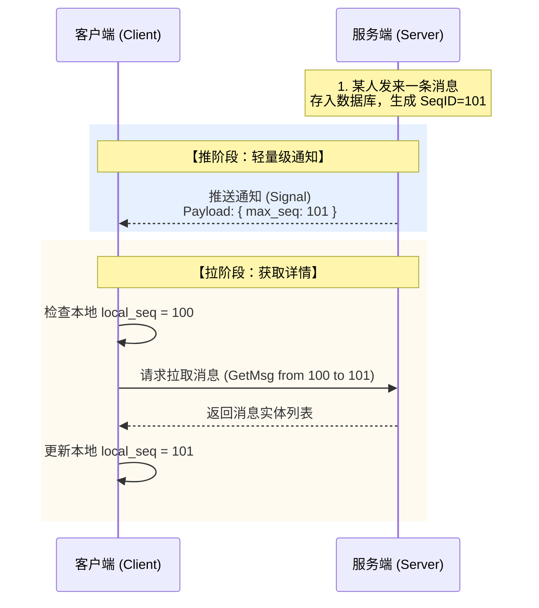

  

**优点**：

- **不丢消息**：即使“推送通知”丢了，客户端下次心跳或重连时，携带 `local_seq` 一比对，依然能把漏掉的消息拉回来。

- **有序性**：客户端严格按照 SeqID 拉取，解决消息乱序问题。

- **节省流量**：合并请求，避免了无效的轮询。

# 系统架构设计

## 架构拓扑图

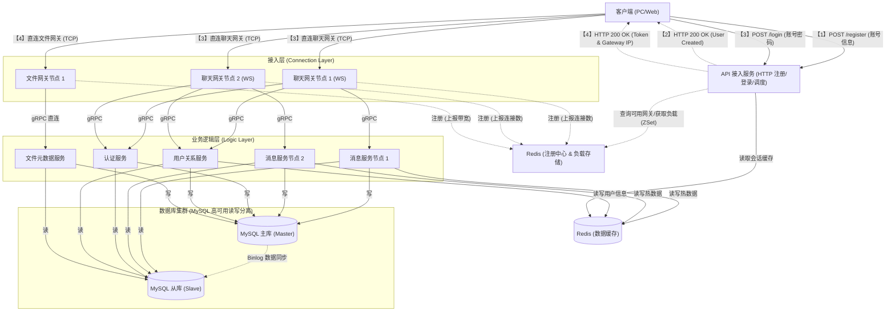

## 微服务划分

### 核心调度与接入层

这部分服务直接面向公网，负责处理海量 TCP/HTTP 连接，不承载复杂业务。

- **API 接入/调度服务 (Dispatch Service)**

    - **协议**：HTTP (REST API)

    - **技术栈**：Boost.Beast / Crow / Drogon

    - **核心职责**：

        - **业务接入**：处理 **用户注册**、**用户登录** 请求。

        - **流量调度**：登录成功后，根据负载均衡算法（最小连接数），分配最佳的 `Chat Gateway` IP。

        - **票据颁发**：返回 Session Token 和 Gateway 地址给客户端。

- **聊天接入网关 (Chat Gateway)**

    - **协议**：WebSocket (Protobuf)

    - **技术栈**：Boost.Asio + C++20 Coroutines

    - **核心职责**：

        - **连接鉴权**：握手阶段校验 URL 参数中的 `token`，无效则断开。

        - **长连接持有**：维护 `Socket Session`，处理 TCP 粘包/拆包、心跳检测（Ping/Pong）。

        - **互踢执行**：订阅 Redis `kick` 频道，收到踢人指令后关闭对应 Connection。

        - **信令转发**：将客户端的二进制包反序列化，通过 gRPC 转发给后端逻辑层。

        - **消息推送**：作为唯一的“出口”，接收后端 gRPC 推送指令，将消息下发给客户端。

        - **状态上报**：定期向 Redis 汇报心跳和当前连接数，供调度服务决策。

- **文件传输网关 (File Gateway)**

    - **协议**：TCP (Custom Binary Protocol)

    - **技术栈**：Boost.Asio (Async IO)

    - **核心职责**：

        - **数据流处理**：专门处理大文件（4GB+）的二进制流上传/下载。

        - **零拷贝转发**：直接将网络流写入磁盘（或反之），不进行复杂的内存拷贝。

        - **流量控制**：限制单连接带宽，防止打爆网卡。

### 2. 业务逻辑层 (Logic Layer)

这部分服务运行在内网，**无状态**，可随时通过 Docker 扩容。

- **认证服务 (Auth Service)**

    - **协议**：gRPC

    - **核心职责**：

        - **鉴权**：处理登录请求，校验密码，生成 Token (JWT)。

        - **踢人逻辑**：检测异地登录，向网关发送“断开连接”指令。

- **用户关系服务 (User Service)**

    - **协议**：gRPC

    - **核心职责**：

        - **资料管理**：用户昵称的增删改查（读写 Redis + MySQL）。

        - **关系链管理**：处理加好友（写双向/单向记录）、删好友、黑名单。

        - **好友列表同步**：提供全量好友 ID 列表查询。

- **消息信箱服务 (Message Service)** —— **系统核心**

    - **协议**：gRPC

    - **核心职责**：

        - **ID 生成**：生成全局唯一的 `MessageID` 和用户维度的 `SeqID`。

        - **写扩散落地**：将消息写入 `im_message_body` 和 `im_message_index`（Timeline）。

        - **推送路由**：查询 Redis 中的 `Session` 信息，定位接收者所在的网关 IP，发起推送。

        - **离线拉取**：响应客户端的 `Sync` 请求，返回 SeqID 范围内的历史消息。

- **文件元数据服务 (File Meta Service)**

    - **协议**：gRPC

    - **核心职责**：

        - **任务管理**：生成 `FileTaskID`，记录文件大小、MD5、上传状态（Uploading/Finished）。

        - **秒传检测**：如果 MD5 已存在，直接返回“成功”。

        - **断点记录**：配合 File Gateway 记录上传进度。

## 高可用与负载均衡策略

### 负载均衡策略 (Load Balancing)

我们将负载均衡分为 **“接入层 LB”**（客户端如何连进来）和 **“服务层 LB”**（内部服务怎么互相调）两个维度。

#### A. 接入层 LB：自研调度服务 (Dispatch Service)

客户端不直接连接网关，而是先访问调度服务（HTTP 短连接），获取分配的网关 IP。

- **聊天网关调度策略：最小连接数 (Least Connections)**

    - **场景**：分配 `Chat Gateway`。

    - **原理**：

        1. 所有 `Chat Gateway` 节点通过 Redis 心跳定期上报当前的 **在线连接数** (使用 `ZADD im:gateway:load connectivity_score gateway_ip`)。

        2. 调度服务查询 Redis ZSet (`ZRANGE im:gateway:load 0 0`)，获取 Score 最小的节点。

        3. 选择连接数 **最少** 的节点 IP 返回给客户端。

    - **优势**：保证各个网关节点的负载最均匀，避免某台机器连接数过高导致内存溢出。

- **文件网关调度策略：一致性哈希 (Consistent Hashing)**

    - **场景**：分配 `File Gateway`。

    - **原理**：根据 **TaskID (文件任务ID)** 或 **UserID** 进行哈希运算：`Hash(TaskID) % NodeCount`。

    - **优势**：

        - **保证断点续传**：同一个文件的所有分片上传请求，只要 TaskID 不变，调度服务永远会把它指向**同一台**文件网关。

        - **利用本地缓存**：文件网关可以将未合并的临时文件存在本地磁盘，无需跨网络传输。

#### B. 服务层 LB：DNS / 配置中心

内部微服务之间（如 Gateway 调用 MsgSvc）不经过任何代理，直接点对点通信。

- **策略：DNS 轮询 / 客户端侧列表**

    - **原理**：利用 Docker 的内置 DNS 服务或 K8s Service，将 `tinyim_auth_server` 解析为多个 IP。gRPC 客户端默认支持 DNS 轮询。

---

### 2. 高可用与容灾策略 (High Availability)

通过 **Redis 心跳机制** 和 **数据冗余** 来消除单点故障。

#### A. 服务节点容灾 (Stateless Services)

针对 **Gateway** (网关) 和 **Logic Service** (认证/消息/用户服务)。

- **故障检测**：

    - 所有服务启动时向 Redis 注册，并设置一个 **TTL (过期时间)**，例如 5 秒。

          - `SETEX im:gateway:info:{ip} 5 {metadata}`

    - 服务运行期间，开启后台线程不断续期（Heartbeat）。

    - **宕机处理**：如果某台服务宕机（断电/崩溃），续期停止。Redis Key 在 5 秒后自动过期。调度服务查不到该节点，自然将其剔除。

- **自动恢复**：

    - **接入层**：调度服务发现某 Gateway 消失（查询 Redis 返回空或不在 ZSet 中），不再向其分配新用户。已连接该 Gateway 的用户会断开 TCP 连接，客户端 SDK 触发重连机制，重新请求调度服务，被分配到新的健康网关。

#### B. 数据存储容灾 (Stateful Storage)

- **MySQL (读写分离)**

    - **Master (主库)**：负责所有写操作。如果 Master 宕机，系统暂时无法发送新消息。

    - **Slave (从库)**：负责所有读操作。如果某个 Slave 宕机，连接池自动切换到其他 Slave 或临时切回 Master 读取。

- **Redis (单体架构)**

    - 在本项目中采用单节点。

    - _生产环境扩展建议_：使用 Redis Sentinel (哨兵) 实现主从自动切换，或 Redis Cluster 实现分片存储。

---

### 3. 核心状态路由 (Session Routing)

这是支撑 **“准确推送”** 和 **“跨服踢人”** 的关键机制。

- **问题**：当 `MsgSvc` 需要给用户 A 推送消息时，它怎么知道用户 A 连在 `Gateway-1` 还是 `Gateway-2`？

- **解决方案**：**Redis 全局会话表**。

    - **登录/连接时**：`Chat Gateway` 在 Redis 中写入：

        - Key: `session:user:1001`

        - Value: `{"gateway_ip": "10.0.0.1", "socket_fd": 12345}`

    - **断线时**：`Chat Gateway` 删除该 Key。

    - **推送时**：`MsgSvc` 先查 Redis 拿到 IP `10.0.0.1`，然后通过 gRPC 直接把消息投递给该网关。

# 数据库设计

设计遵循 **“读写分离”** 和 **“最终一致性”** 原则。

- **MySQL**: 负责数据的持久化存储（Source of Truth）。    

- **Redis**: 负责全局自增 ID、热点数据缓存和会话状态存储。

## 1. MySQL 表结构设计

### A. 用户与关系模块

#### (1) 用户基础表 (`im_user`)

存储用户的账号信息。

- **设计要点**：`user_id` 是系统的核心主键，其他表都通过它关联。

```sql

CREATE TABLE `im_user` (

  `user_id` BIGINT UNSIGNED NOT NULL AUTO_INCREMENT COMMENT '用户唯一ID',

  `username` VARCHAR(32) NOT NULL DEFAULT '' COMMENT '用户名/账号',

  `password` VARCHAR(128) NOT NULL DEFAULT '' COMMENT '加密后的密码',

  `nickname` VARCHAR(64) NOT NULL DEFAULT '' COMMENT '昵称',

  `created_at` TIMESTAMP DEFAULT CURRENT_TIMESTAMP,

  `updated_at` TIMESTAMP DEFAULT CURRENT_TIMESTAMP ON UPDATE CURRENT_TIMESTAMP,

  PRIMARY KEY (`user_id`),

  UNIQUE KEY `uk_username` (`username`)

) ENGINE=InnoDB DEFAULT CHARSET=utf8mb4 COMMENT='用户基础表';

```

#### (2) 用户关系表 (`im_relation`)

用于存储好友关系。

- **设计要点**：采用 **双向存储** 策略来支持单向好友（单删）。

    - A 添加 B：插入 `(A, B)` 和 `(B, A)`。

    - A 拉黑 B：更新 `(A, B)` 的状态，不影响 `(B, A)`。

    - A 删除 B：删除 `(A, B)`，B 的列表里依然有 A（但无法发消息）。

```sql

CREATE TABLE `im_relation` (

  `id` BIGINT UNSIGNED NOT NULL AUTO_INCREMENT,

  `user_id` BIGINT UNSIGNED NOT NULL COMMENT '所属用户ID (Owner)',

  `friend_id` BIGINT UNSIGNED NOT NULL COMMENT '好友ID',

  `status` TINYINT NOT NULL DEFAULT 1 COMMENT '状态: 1-正常, 2-拉黑, 3-删除',

  `remark` VARCHAR(64) DEFAULT '' COMMENT '好友备注',

  `created_at` TIMESTAMP DEFAULT CURRENT_TIMESTAMP,

  `updated_at` TIMESTAMP DEFAULT CURRENT_TIMESTAMP ON UPDATE CURRENT_TIMESTAMP,

  PRIMARY KEY (`id`),

  UNIQUE KEY `uk_user_friend` (`user_id`, `friend_id`), -- 复合唯一索引，防重复

  KEY `idx_friend_id` (`friend_id`) -- 用于查询"谁加了我"

) ENGINE=InnoDB DEFAULT CHARSET=utf8mb4 COMMENT='用户关系表';

```

### B. 消息存储模块 (核心 Timeline)

这是 **写扩散** 模型的具体实现，将消息拆分为“内容”和“索引”。

#### (3) 消息内容表 (`im_message_body`)

- **作用**：全量存储消息内容。无论群里有多少人，内容只存一份。

- **msg_id**：使用 Snowflake (雪花算法) 生成全局唯一 ID。

```sql

CREATE TABLE `im_message_body` (

  `msg_id` BIGINT UNSIGNED NOT NULL COMMENT '消息全局唯一ID',

  `sender_id` BIGINT UNSIGNED NOT NULL COMMENT '发送者ID',

  `group_id` BIGINT UNSIGNED NOT NULL DEFAULT 0 COMMENT '群ID (0=单聊)',

  `msg_type` TINYINT NOT NULL DEFAULT 1 COMMENT '类型: 1-文本, 2-图片, 3-文件, 4-语音',

  `msg_content` TEXT COMMENT '消息内容 (JSON payload)',

  `msg_extra` VARCHAR(512) DEFAULT '' COMMENT '扩展字段 (如引用回复ID)',

  `created_at` TIMESTAMP DEFAULT CURRENT_TIMESTAMP,

  PRIMARY KEY (`msg_id`),

  KEY `idx_sender` (`sender_id`),

  KEY `idx_create_time` (`created_at`)

) ENGINE=InnoDB DEFAULT CHARSET=utf8mb4 COMMENT='消息内容全量表';

```

#### (4) 消息信箱表 (`im_message_index`) —— **Timeline 核心**

- **作用**：每个用户的收件箱。群发消息时，会在这里插入 N 条记录。

- **seq_id (关键)**：每个用户独立的逻辑时钟。

    - 用户 A 的信箱：seq_id = 1, 2, 3...

    - 用户 B 的信箱：seq_id = 1, 2, 3...

    - **拉取逻辑**：客户端记录 `local_seq`，上线请求 `WHERE owner_id=A AND seq_id > local_seq`。

```sql

CREATE TABLE `im_message_index` (

  `id` BIGINT UNSIGNED NOT NULL AUTO_INCREMENT,

  `owner_id` BIGINT UNSIGNED NOT NULL COMMENT '信箱所属用户ID (谁的消息)',

  `other_id` BIGINT UNSIGNED NOT NULL COMMENT '会话对象ID (发送者或群ID)',

  `msg_id` BIGINT UNSIGNED NOT NULL COMMENT '关联的消息内容ID',

  `seq_id` BIGINT UNSIGNED NOT NULL COMMENT '序列号 (单调递增)',

  `is_sender` TINYINT NOT NULL DEFAULT 0 COMMENT '0-接收, 1-发送 (用于多端同步)',

  `created_at` TIMESTAMP DEFAULT CURRENT_TIMESTAMP,

  PRIMARY KEY (`id`),

  UNIQUE KEY `uk_owner_seq` (`owner_id`, `seq_id`), -- 核心索引：同步拉取用

  KEY `idx_owner_other` (`owner_id`, `other_id`, `created_at`) -- 辅助索引：查历史记录用

) ENGINE=InnoDB DEFAULT CHARSET=utf8mb4 COMMENT='用户消息信箱表(Timeline)';

```

  

---

  

### C. 群组模块

  

#### (5) 群组基础表 (`im_group`)

```sql

CREATE TABLE `im_group` (

  `group_id` BIGINT UNSIGNED NOT NULL AUTO_INCREMENT,

  `group_name` VARCHAR(64) NOT NULL COMMENT '群名称',

  `owner_id` BIGINT UNSIGNED NOT NULL COMMENT '群主ID',

  `announcement` VARCHAR(255) DEFAULT '' COMMENT '群公告',

  `status` TINYINT DEFAULT 1 COMMENT '1-正常, 0-解散',

  `created_at` TIMESTAMP DEFAULT CURRENT_TIMESTAMP,

  `updated_at` TIMESTAMP DEFAULT CURRENT_TIMESTAMP ON UPDATE CURRENT_TIMESTAMP,

  PRIMARY KEY (`group_id`)

) ENGINE=InnoDB DEFAULT CHARSET=utf8mb4 COMMENT='群组基础表';

```

#### (6) 群成员表 (`im_group_member`)

- **作用**：记录群里有哪些人。写扩散时，根据这张表查询出所有接收者 ID。

```sql

CREATE TABLE `im_group_member` (

  `id` BIGINT UNSIGNED NOT NULL AUTO_INCREMENT,

  `group_id` BIGINT UNSIGNED NOT NULL,

  `user_id` BIGINT UNSIGNED NOT NULL,

  `role` TINYINT DEFAULT 1 COMMENT '1-普通, 2-管理员, 3-群主',

  `created_at` TIMESTAMP DEFAULT CURRENT_TIMESTAMP,

  PRIMARY KEY (`id`),

  UNIQUE KEY `uk_group_user` (`group_id`, `user_id`), -- 防重复加群

  KEY `idx_user` (`user_id`) -- 查"我加了哪些群"

) ENGINE=InnoDB DEFAULT CHARSET=utf8mb4 COMMENT='群成员表';

```

---

### D. 文件传输模块 (配合自研 File Gateway)

#### (7) 文件任务表 (`im_file_task`)

- **作用**：支持断点续传和秒传。

```sql

CREATE TABLE `im_file_task` (

  `task_id` CHAR(36) NOT NULL COMMENT '任务UUID',

  `user_id` BIGINT UNSIGNED NOT NULL COMMENT '上传者ID',

  `file_name` VARCHAR(255) NOT NULL COMMENT '原始文件名',

  `file_size` BIGINT UNSIGNED NOT NULL COMMENT '文件总大小(字节)',

  `file_md5` CHAR(32) NOT NULL DEFAULT '' COMMENT '文件MD5 (用于秒传)',

  `status` TINYINT NOT NULL DEFAULT 0 COMMENT '0-上传中, 1-已完成, 2-已取消',

  `current_size` BIGINT UNSIGNED DEFAULT 0 COMMENT '已上传大小 (用于展示进度)',

  `storage_path` VARCHAR(512) NOT NULL DEFAULT '' COMMENT '服务器磁盘物理路径',

  `created_at` TIMESTAMP DEFAULT CURRENT_TIMESTAMP,

  `updated_at` TIMESTAMP DEFAULT CURRENT_TIMESTAMP ON UPDATE CURRENT_TIMESTAMP,

  PRIMARY KEY (`task_id`),

  KEY `idx_md5` (`file_md5`) -- 秒传查询索引

) ENGINE=InnoDB DEFAULT CHARSET=utf8mb4 COMMENT='文件上传任务表';

```

## 2. Redis 键值结构设计

Redis 在本项目中不只是缓存，而是**存储核心状态**。

### A. 会话路由 (Session)

- **作用**：记录用户连接在哪个网关 IP 上，用于消息推送。

- **Key 格式**：`im:session:{user_id}`

- **Type**: `Hash`

- **Fields**:

    - `gateway_ip`: "10.0.0.1" (网关IP)

    - `conn_fd`: "1024" (Socket句柄)

    - `device_type`: "PC" (设备类型)

- **TTL**: 设置为心跳间隔的 2 倍（如 60秒），过期自动离线。

### B. 序列号生成 (Sequence ID)

- **作用**：生成单调递增的 Timeline ID。

- **Key 格式**：`im:seq:{user_id}`

- **Type**: `String` (Counter)

- **操作**: `INCR`

- **逻辑**：每次向 `im_message_index` 插入数据前，先 `INCR im:seq:1001` 拿到最新的 ID。

### C. 用户信息缓存 (User Cache)

- **作用**：减少 `im_user` 表的查询压力（IM 中查看头像昵称极度高频）。

- **Key 格式**：`im:user:{user_id}`

- **Type**: `String` (Protobuf 序列化后的二进制数据 或 JSON)

- **策略**: Cache Aside (旁路缓存) —— 先读 Redis，没有读 DB 并回写。

# 通信协议设计

## 1. 网络传输协议设计

本项目客户端（PC 端与 Web 端）与服务端之间的通信，**全链路采用 WebSocket 协议**。

相比于传统的 TCP 自定义协议，使用 WebSocket 的优势在于：

1. **天然的帧（Frame）机制**：WebSocket 协议底层已解决了“粘包/拆包”问题，Boost.Beast 会保证每次回调都是一个完整的数据帧。

2. **全端统一**：Web 端（浏览器）和 PC 端（C++）使用完全一致的通信逻辑，降低维护成本。

3. **穿透性强**：直接复用 HTTP 端口（80/443），避免防火墙拦截非标准 TCP 端口。

### A. 封包结构图

虽然 WebSocket 解决了网络层的粘包问题，但业务层依然需要定义**应用层协议头**。我们需要在 WebSocket 的 **Binary Frame（二进制帧）** 中，嵌入一个固定长度的包头，用于标识业务类型（CmdID）和进行安全校验。

  


  

### B. 字段定义

### B. 字段详细定义

  

| **字段名**     | **长度**  | **类型**     | **说明**                                                                             |

| ----------- | ------- | ---------- | ---------------------------------------------------------------------------------- |

| **Magic**   | 2 Bytes | `char[2]`  | **魔数**。固定为 `'I', 'M'`。用于业务层校验，防止非 IM 客户端误连或攻击。                                     |

| **Version** | 1 Byte  | `uint8_t`  | **协议版本**。当前版本 `1`。用于后续协议升级兼容。                                                      |

| **Cmd ID**  | 2 Bytes | `uint16_t` | **命令字**。核心字段，决定了 Body 是“登录请求”还是“发送消息”。网关据此转发给不同的后端服务。                              |

| **Length**  | 4 Bytes | `uint32_t` | **Body 长度校验**。虽然 WebSocket 提供了帧长度，但保留此字段用于双重校验（`FrameSize == 9 + Length`），确保数据完整性。 |

| **Body**    | N Bytes | `binary`   | **业务数据**。Google Protobuf 序列化后的二进制流。                                                |

  

### C. C++ 包头结构体定义

在 C++ 项目中（`server/common/protocol.h`），需要定义这个结构：

```cpp

// 包头固定长度: 2 + 1 + 2 + 4 = 9 字节

constexpr int HEAD_LENGTH = 9;

  

#pragma pack(push, 1) // 强制 1 字节对齐，防止内存空洞

struct PacketHeader {

    char magic[2] = {'I', 'M'}; // 魔数

    uint8_t version = 1;        // 版本

    uint16_t cmd_id = 0;        // 命令字

    uint32_t body_len = 0;      // 包体长度

};

#pragma pack(pop)

```

  

## 2. 业务命令字定义

我们需要一个枚举来管理所有的操作类型。

```cpp

enum CommandID : uint16_t {

    // ===================================

    // 1. 基础与鉴权 (0x1000 - 0x1FFF)

    // ===================================

    CMD_LOGIN_REQ       = 0x1001, // 登录

    CMD_LOGIN_RESP      = 0x1002,

    CMD_HEARTBEAT_REQ   = 0x1003, // 心跳

    CMD_HEARTBEAT_RESP  = 0x1004,

    CMD_KICK_NOTIFY     = 0x1005, // 踢人通知

  

    // ===================================

    // 2. 消息业务 (0x2000 - 0x2FFF)

    // ===================================

    CMD_MSG_SEND_REQ    = 0x2001, // 发消息

    CMD_MSG_SEND_RESP   = 0x2002,

    CMD_MSG_PUSH_NOTIFY = 0x2003, // 新消息通知(推)

    CMD_MSG_SYNC_REQ    = 0x2004, // 消息同步(拉)

    CMD_MSG_SYNC_RESP   = 0x2005,

  

    // ===================================

    // 3. 文件业务 (0x3000 - 0x3FFF)

    // ===================================

    CMD_FILE_UPLOAD_REQ = 0x3001, // 申请上传

    CMD_FILE_UPLOAD_ACK = 0x3002, // 上传确认(包含offset)

    CMD_FILE_DATA_TRANS = 0x3003, // 文件二进制流传输

  

    // ===================================

    // 4. 社交与关系链 (0x4000 - 0x4FFF)

    // ===================================

    // --- 好友相关 ---

    CMD_FRIEND_APPLY_REQ   = 0x4001, // 申请添加好友

    CMD_FRIEND_APPLY_RESP  = 0x4002,

    CMD_FRIEND_HANDLE_REQ  = 0x4003, // 处理好友申请(同意/拒绝)

    CMD_FRIEND_HANDLE_RESP = 0x4004,

    CMD_FRIEND_LIST_REQ    = 0x4005, // 获取好友列表

    CMD_FRIEND_LIST_RESP   = 0x4006,

    CMD_FRIEND_DEL_REQ     = 0x4007, // 删除好友

    CMD_FRIEND_DEL_RESP    = 0x4008,

  

    // --- 群组相关 ---

    CMD_GROUP_CREATE_REQ   = 0x4009, // 创建群组

    CMD_GROUP_CREATE_RESP  = 0x400A,

    CMD_GROUP_JOIN_REQ     = 0x400B, // 申请加群

    CMD_GROUP_JOIN_RESP    = 0x400C,

    CMD_GROUP_LIST_REQ     = 0x400D, // 获取我的群列表

    CMD_GROUP_LIST_RESP    = 0x400E,

    CMD_GROUP_MEMBER_REQ   = 0x400F, // 获取群成员列表

    CMD_GROUP_MEMBER_RESP  = 0x4010

};

```

## 3. 业务数据协议

基于 **Timeline 写扩散** 模型和 **推拉结合** 同步策略的 `im_protocol. proto` 定义。

```Protocol Buffers

syntax = "proto3";

package im;

  

// ==========================================

// 1. 基础数据结构 & 枚举

// ==========================================

  

// 消息内容类型

enum MsgType {

    TEXT       = 0; // 普通文本

    IMAGE      = 1; // 图片 (Body 存 JSON 或 URL)

    FILE       = 2; // 文件 (Body 存 JSON: {task_id, file_name, size})

    SYSTEM     = 3; // 系统通知 (如: "你已被移出群聊")

    FRIEND_REQ = 4; // 好友申请消息 (Body 存 JSON: {request_uid, reason})

}

  

// 用户基础信息

message UserInfo {

    uint64 user_id  = 1;

    string nickname = 2;

    string username = 3;

    // string avatar = 4; // 数据库已移除，协议层保留字段但暂传空值

}

  

// 群组基础信息

message GroupInfo {

    uint64 group_id     = 1;

    string group_name   = 2;

    uint64 owner_id     = 3;

    string announcement = 4;

}

  

// 核心消息实体 (Timeline存储单元)

message MessageData {

    uint64 msg_id      = 1; // 全局唯一消息ID (Snowflake)

    uint64 seq_id      = 2; // 用户信箱维度的序列号 (单调递增)

    uint64 sender_id   = 3; // 发送者ID

    uint64 receiver_id = 4; // 接收者ID (如果是单聊)

    uint64 group_id    = 5; // 群ID (0=单聊, 非0=群聊)

    MsgType type       = 6; // 消息类型

    string content     = 7; // 消息内容

    uint64 create_time = 8; // 发送时间戳 (毫秒)

}

  

// ==========================================

// 2. 认证与心跳 (Auth & Connection)

// ==========================================

  

// [注意]：注册(Register) 和 登录(Login) 接口已迁移至 HTTP API。

// WebSocket 建立连接时，需在 URL 参数携带 Token 进行验证，例如:

// ws://gateway_ip:8080/chat?token=xxxx&device_id=PC

  

// 互踢逻辑 (Kick Logic):

// 1. 用户在新设备 (PC-2) 发起 HTTP 登录。

// 2. Auth 服务生成新 Token，写入 Redis，并发布 "Kick" 事件。

// 3. Gateway 收到事件，找到旧设备 (PC-1) 的连接，发送下面的 KickNotify 包，然后强制关闭连接。

  

// [上行] 心跳请求

    uint64 user_id = 1;

    string token   = 2; // 密码或鉴权Token

    string device_id = 3; // 设备标识

}

  

// [响应] 登录响应

// CmdID: 0x1002

message LoginResp {

    bool success     = 1;

    string err_msg   = 2;

    uint64 server_time = 3;

    string session_id = 4; // 可能会下发一个临时会话ID

}

  

// [上行] 心跳请求

// CmdID: 0x1003

message HeartbeatReq {

    uint64 user_id = 1;

}

  

// [响应] 心跳响应

// CmdID: 0x1004

message HeartbeatResp {

    uint64 server_time = 1;

}

  

// [下行] 强制下线通知 (服务端主动推送)

// CmdID: 0x1005

message KickNotify {

    string reason = 1; // 例如: "异地登录"

}

  
  

// ==========================================

// 3. 消息收发 (Msg Service) - 核心业务

// ==========================================

  

// [上行] 发送消息请求

// CmdID: 0x2001

message MsgSendReq {

    uint64 receiver_id = 1; // 接收者ID (单聊必填)

    uint64 group_id    = 2; // 群ID (群聊必填，单聊填0)

    MsgType type       = 3; // 消息类型

    string content     = 4; // 消息内容

}

  

// [响应] 发送消息确认 (Ack)

// CmdID: 0x2002

message MsgSendResp {

    uint64 msg_id    = 1; // 服务端生成的全局唯一MsgID

    uint64 seq_id    = 2; // 该消息在"发送者"Timeline中的SeqID (用于多端同步)

    uint64 send_time = 3; // 落库时间

}

  

// [下行] 新消息通知 (推模式 - 仅推送信号)

// CmdID: 0x2003

message MsgPushNotify {

    uint64 max_seq_id = 1; // 告诉客户端：你的信箱最新 SeqID 已经是这个值了

    // 客户端收到后，对比本地 local_seq，如果 max_seq_id > local_seq，则发起 Sync 请求

}

  

// [上行] 消息同步/拉取请求 (拉模式)

// CmdID: 0x2004

message MsgSyncReq {

    uint64 user_id       = 1;

    uint64 local_max_seq = 2; // 客户端本地当前最新的 SeqID

    uint32 limit         = 3; // 分页限制 (例如一次拉 50 条)

}

  

// [响应] 消息同步结果

// CmdID: 0x2005

message MsgSyncResp {

    uint64 max_seq             = 1; // 服务端当前的最新 SeqID

    repeated MessageData msgs  = 2; // 消息列表

    bool has_more              = 3; // 是否还有更多未拉取

}

  
  

// ==========================================

// 4. 文件业务 (File Service)

// ==========================================

  

// [上行] 申请上传文件

// CmdID: 0x3001

message FileUploadReq {

    string file_name   = 1;

    uint64 file_size   = 2;

    string md5         = 3; // 用于秒传检测

    uint64 receiver_id = 4; // 接收者ID (用于鉴权)

}

  

// [响应] 申请结果

// CmdID: 0x3002

message FileUploadResp {

    string task_id       = 1; // 任务ID

    bool is_instant      = 2; // 是否秒传成功 (True则无需传输数据)

    string gateway_ip    = 3; // 指定上传的文件网关IP

    uint32 gateway_port  = 4; // 端口

    string upload_token  = 5; // 上传凭证 (发给文件网关鉴权用)

}

  
  

// ==========================================

// 5. 社交关系链 (Social - Friend)

// ==========================================

  

// [上行] 申请添加好友

// CmdID: 0x4001

message FriendApplyReq {

    uint64 target_user_id = 1; // 目标用户ID

    string reason         = 2; // 申请理由

}

  

// [响应] 申请提交结果

// CmdID: 0x4002

message FriendApplyResp {

    bool success   = 1;

    string err_msg = 2;

}

  

// [上行] 处理好友申请

// CmdID: 0x4003

message FriendHandleReq {

    uint64 request_user_id = 1; // 谁申请加我

    bool agree             = 2; // 同意(true) 还是 拒绝(false)

}

  

// [响应] 处理结果

// CmdID: 0x4004

message FriendHandleResp {

    bool success = 1;

    string err_msg = 2;

}

  

// [上行] 获取好友列表

// CmdID: 0x4005

message FriendListReq {

    uint64 user_id = 1; // 通常填自己的ID

}

  

// [响应] 返回好友列表

// CmdID: 0x4006

message FriendListResp {

    repeated UserInfo friends = 1;

}

  

// [上行] 删除好友

// CmdID: 0x4007

message FriendDelReq {

    uint64 friend_id = 1;

}

  

// [响应] 删除结果

// CmdID: 0x4008

message FriendDelResp {

    bool success = 1;

}

  
  

// ==========================================

// 6. 群组管理 (Social - Group)

// ==========================================

  

// [上行] 创建群组

// CmdID: 0x4009

message GroupCreateReq {

    string group_name = 1;

    repeated uint64 member_ids = 2; // 初始拉谁进群

}

  

// [响应] 创建结果

// CmdID: 0x400A

message GroupCreateResp {

    uint64 group_id = 1;

    bool success    = 2;

}

  

// [上行] 申请/加入群组

// CmdID: 0x400B

message GroupJoinReq {

    uint64 group_id = 1;

}

  

// [响应] 加入结果

// CmdID: 0x400C

message GroupJoinResp {

    bool success = 1;

    // 如果群开启了审批，这里可能返回 "PENDING" 状态

}

  

// [上行] 获取我的群列表

// CmdID: 0x400D

message GroupListReq {

    uint64 user_id = 1;

}

  

// [响应] 返回群列表

// CmdID: 0x400E

message GroupListResp {

    repeated GroupInfo groups = 1;

}

  

// [上行] 获取群成员列表

// CmdID: 0x400F

message GroupMemberReq {

    uint64 group_id = 1;

}

  

// [响应] 返回群成员

// CmdID: 0x4010

message GroupMemberResp {

    repeated UserInfo members = 1;

}

```

  
  

## 4. 核心交互时序

这部分展示了 WebSocket 协议如何在核心业务场景中流转。

### 场景一：消息收发与推拉结合 (Message Sync)

这是 IM 最核心的流程。注意：**服务端只推“信号”，客户端主动“拉数据”**。

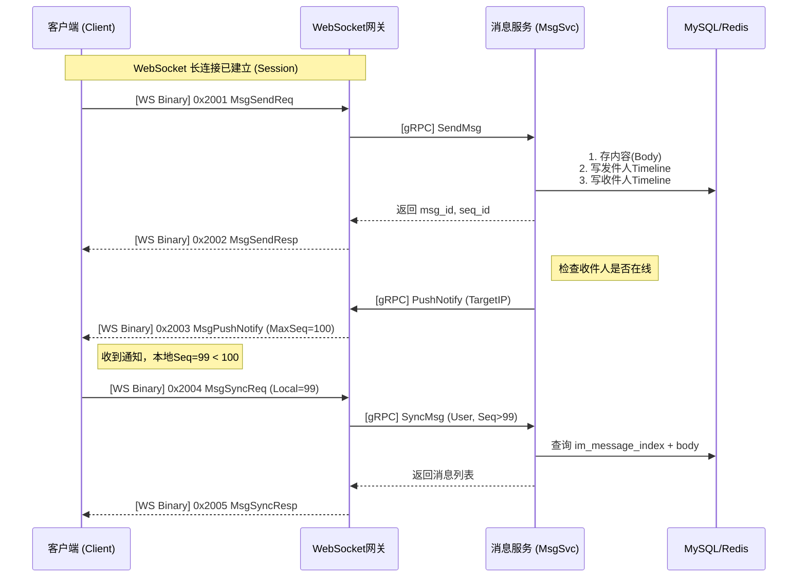

  

### 场景二：加好友流程 (Timeline 复用模式)

展示了如何将“社交请求”转化为“系统消息”，从而复用 Timeline 的同步机制。

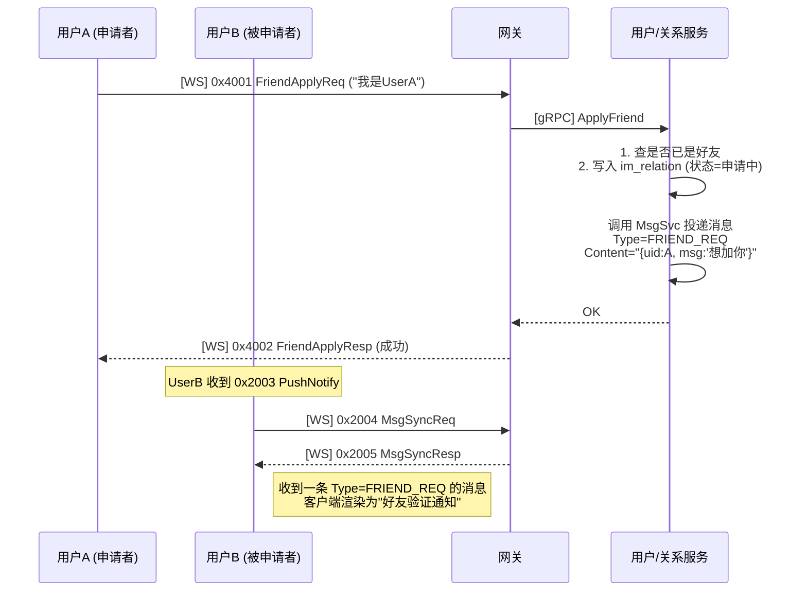

  

---

# API 接口设计

本章节定义了微服务集群内部的通信接口。所有的内部服务间通信均采用 **gRPC** 协议，数据序列化依然使用 **Protobuf**。

  

为了保持工程结构的清晰，我们将内部 RPC 服务定义在一个新的文件 `im_internal.proto` 中，并引用上一章的 `im_protocol.proto` 来复用基础数据结构。

  

## 内部服务定义

引入 **“Context 包装”** 的设计模式：网关在转发请求时，需要把已认证的 `user_id`、`client_ip` 等信息附加在请求中传递给后端。

```Protocol Buffers

syntax = "proto3";

package im;

  

// 引入上一章定义的公共数据结构

import "im_protocol.proto";

  

option go_package = "./pb"; // 如果未来用Go重构方便，C++忽略此行

  

// ==========================================

// 1. 通用请求包装 (Context Wrapper)

// ==========================================

// 网关调用逻辑层时，必须带上经过鉴权的用户信息

message ContextReq {

    uint64 user_id = 1;     // 发起请求的用户ID (网关从Session中获取)

    string device_id = 2;   // 设备ID

    string client_ip = 3;   // 客户端IP

    string request_id = 4;  // 用于全链路追踪的TraceID

}

  

// ==========================================

// 2. 认证服务 (Auth Service)

// ==========================================

service AuthService {

    // 处理登录请求

    rpc Login(LoginReq) returns (LoginResp);

    // 校验 Token (其他服务可能调用此接口鉴权)

    rpc ValidateToken(ValidateTokenReq) returns (ValidateTokenResp);

}

  

message ValidateTokenReq {

    uint64 user_id = 1;

    string token = 2;

}

  

message ValidateTokenResp {

    bool valid = 1;

}

  
  

// ==========================================

// 3. 消息服务 (Msg Service)

// ==========================================

service MsgService {

    // [上行] 发送消息

    // 网关收到 MsgSendReq 后，包装成 SendMsgReq 调用此接口

    rpc SendMsg(SendMsgInternalReq) returns (MsgSendResp);

  

    // [上行] 同步/拉取消息

    rpc SyncMsg(MsgSyncReq) returns (MsgSyncResp);

  

    // [内部] 获取会话最近的一条消息 (用于生成会话列表快照)

    rpc GetLatestMsg(GetLatestMsgReq) returns (MessageData);

}

  

// 内部发送请求包装

message SendMsgInternalReq {

    ContextReq ctx = 1;          // 包含发送者ID

    MsgSendReq msg_req = 2;      // 包含接收者、内容

}

  

message GetLatestMsgReq {

    uint64 user_id = 1;

    uint64 other_id = 2; // 好友ID或群ID

}

  
  

// ==========================================

// 4. 用户与关系服务 (User Service)

// ==========================================

service UserService {

    // --- 基础信息 ---

    rpc GetUserInfo(GetUserInfoReq) returns (GetUserInfoResp);

    // --- 好友逻辑 ---

    rpc AddFriend(AddFriendInternalReq) returns (FriendApplyResp);

    rpc HandleFriendApply(HandleFriendInternalReq) returns (FriendHandleResp);

    rpc GetFriendList(FriendListReq) returns (FriendListResp);

    // --- 群组逻辑 ---

    rpc CreateGroup(CreateGroupInternalReq) returns (GroupCreateResp);

    rpc GetGroupList(GroupListReq) returns (GroupListResp);

    rpc GetGroupMembers(GroupMemberReq) returns (GroupMemberResp);

}

  

message GetUserInfoReq {

    repeated uint64 user_ids = 1; // 批量查询

}

  

message GetUserInfoResp {

    map<uint64, UserInfo> users = 1;

}

  

// 包装 wrapper，确保知道是谁发起的请求

message AddFriendInternalReq {

    ContextReq ctx = 1;

    FriendApplyReq req = 2;

}

  

message HandleFriendInternalReq {

    ContextReq ctx = 1;

    FriendHandleReq req = 2;

}

  

message CreateGroupInternalReq {

    ContextReq ctx = 1;

    GroupCreateReq req = 2;

}

  
  

// ==========================================

// 5. 文件元数据服务 (File Service)

// ==========================================

service FileService {

    // 申请上传 (Pre-sign)

    rpc ApplyUpload(ApplyUploadInternalReq) returns (FileUploadResp);

    // 更新上传状态 (文件网关上传完毕后调用此接口)

    rpc UpdateFileStatus(UpdateFileStatusReq) returns (UpdateFileStatusResp);

}

  

message ApplyUploadInternalReq {

    ContextReq ctx = 1;

    FileUploadReq req = 2;

}

  

message UpdateFileStatusReq {

    string task_id = 1;

    int32 status = 2; // 1=完成, 2=失败

    string file_url = 3; // 只有在用到对象存储时才需要

}

  

message UpdateFileStatusResp {

    bool success = 1;

}

```

  

## 反向 RPC：网关服务

这是一个非常特殊的接口。通常 RPC 都是 **网关 -> 逻辑层**。 但在 **推送 (Push)** 场景下，**消息服务 (MsgSvc)** 需要主动把消息推给 **网关 (Gateway)**，再由网关下发给 TCP/WebSocket 连接。

  

**注意**：由于网关有多个节点，`MsgSvc` 需要先查 Redis 知道用户连接在哪个 IP，然后建立 gRPC 连接去调用那个特定 IP 的 `GatewayService`。

  

```Protocol Buffers

// 定义在 im_internal.proto 尾部

  

// ==========================================

// 6. 网关推送服务 (Gateway Service)

// ==========================================

// 注意：这个 Service 是实现在 Gateway 进程里的！

// MsgService 作为 Client 来调用它。

  

service GatewayService {

    // 推送消息通知 (Notify 信号)

    rpc PushNotify(PushNotifyInternalReq) returns (PushNotifyResp);

    // 踢人下线 (Kick)

    rpc KickUser(KickUserInternalReq) returns (KickUserResp);

}

  

message PushNotifyInternalReq {

    uint64 user_id = 1;      // 推给谁

    MsgPushNotify notify = 2; // 推送的内容 (Protobuf 结构体)

}

  

message PushNotifyResp {

    bool success = 1;

    bool user_offline = 2; // 如果用户刚好断开，告知逻辑层

}

  

message KickUserInternalReq {

    uint64 user_id = 1;

    string reason = 2;

}

  

message KickUserResp {

    bool success = 1;

}

```

  

## 全链路调用流程示例

为了串联上述接口，我们来看一个 **“发送消息”** 的完整调用链。

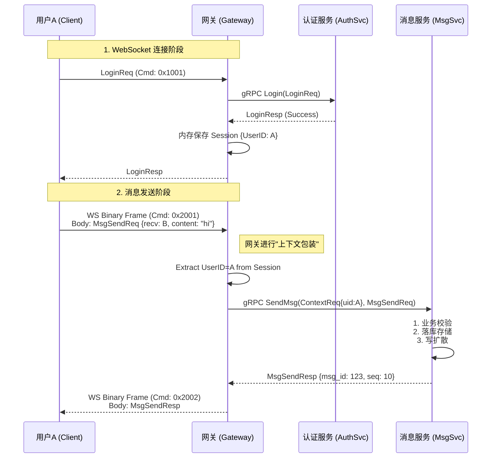

# 核心交互流程

本章节使用 **时序图** 展示关键业务的调用链。

**核心原则**：所有的“被动接收”逻辑（如别人加我好友、别人拉我入群），统一复用 **Timeline 消息同步机制**。即：**“一切皆消息”**。

## 1. 用户登录与初始化流程

这是用户打开 App 后的第一步，涉及调度、连接、鉴权和数据拉取。

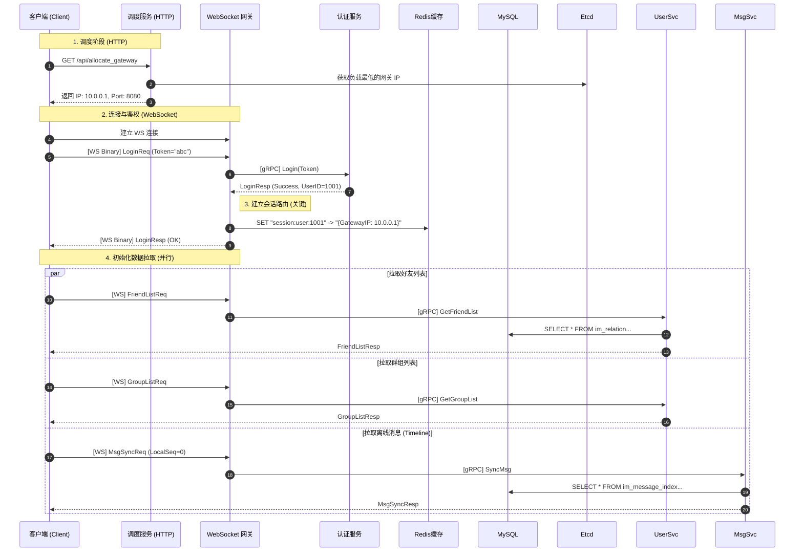

## 2. 核心：好友申请流程

  

**场景**：用户 A 申请添加用户 B 为好友。

**设计亮点**：B 不需要轮询“好友申请列表”，而是通过 **Timeline** 收到一条 `MsgType=FRIEND_REQ` 的消息。客户端收到后，在界面上显示“新的朋友”红点。

  

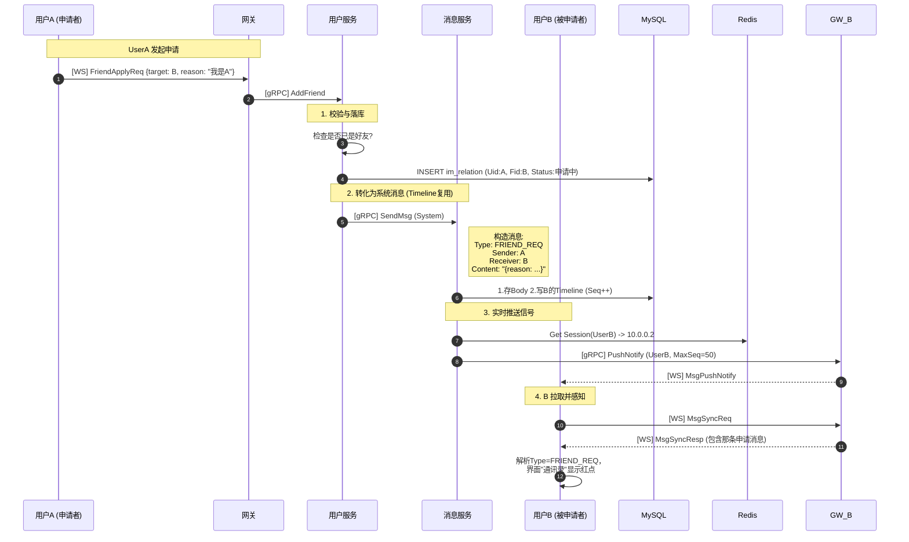

  

---

  

## 3. 核心：单聊消息全链路 (1-on-1 Chat)

  

**场景**：A 发送消息给 B。涵盖了 **发送、存储、推送、拉取** 四个步骤。

  

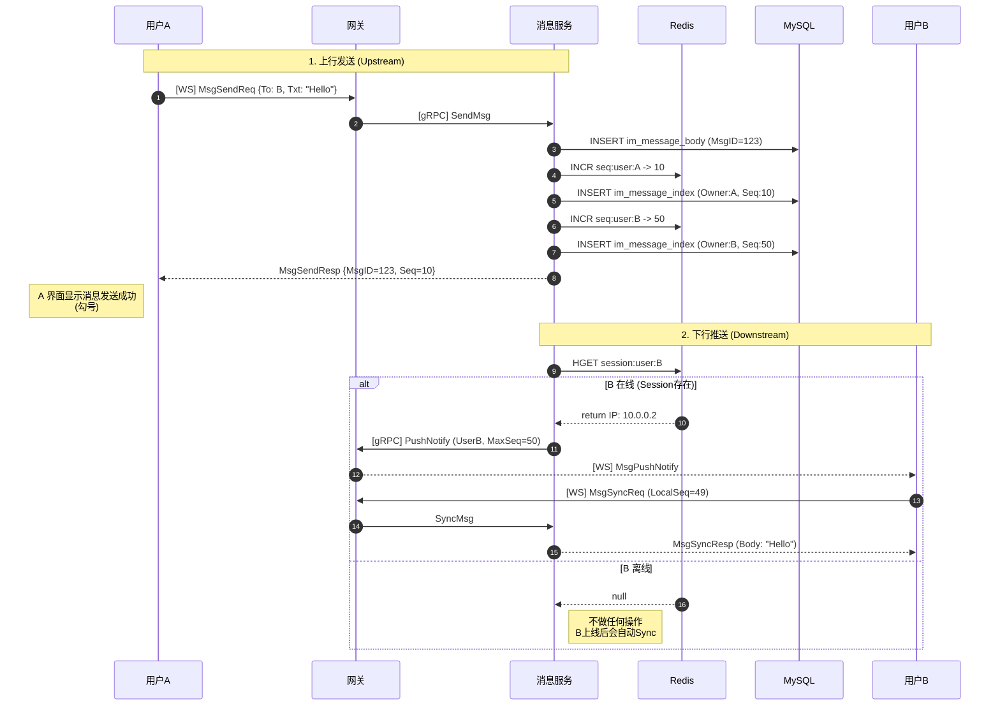

  

---

  

## 4. 核心：群聊消息与加群流程

  

### A. 申请加群

这与加好友类似，但通知的对象是 **群主 (Owner)**。

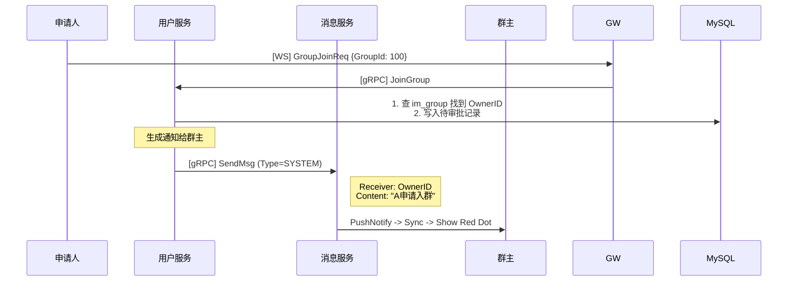

  

### B. 群聊消息发送 (Write Diffusion)

  

**场景**：A 在 500 人的群里发了一条消息。

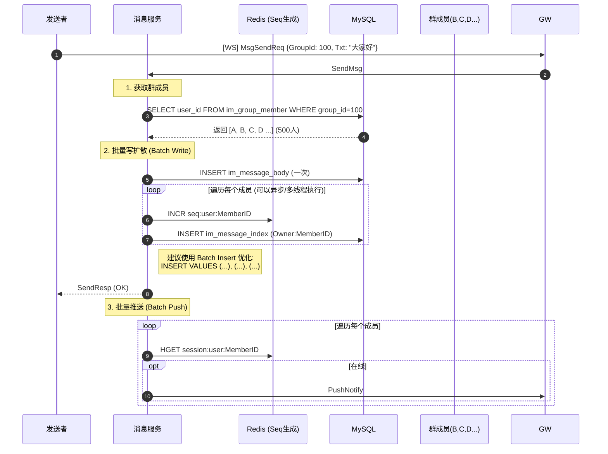

  

---

  

## 5. 心跳保活与断线

如何维护用户在线状态，并处理异常断线。

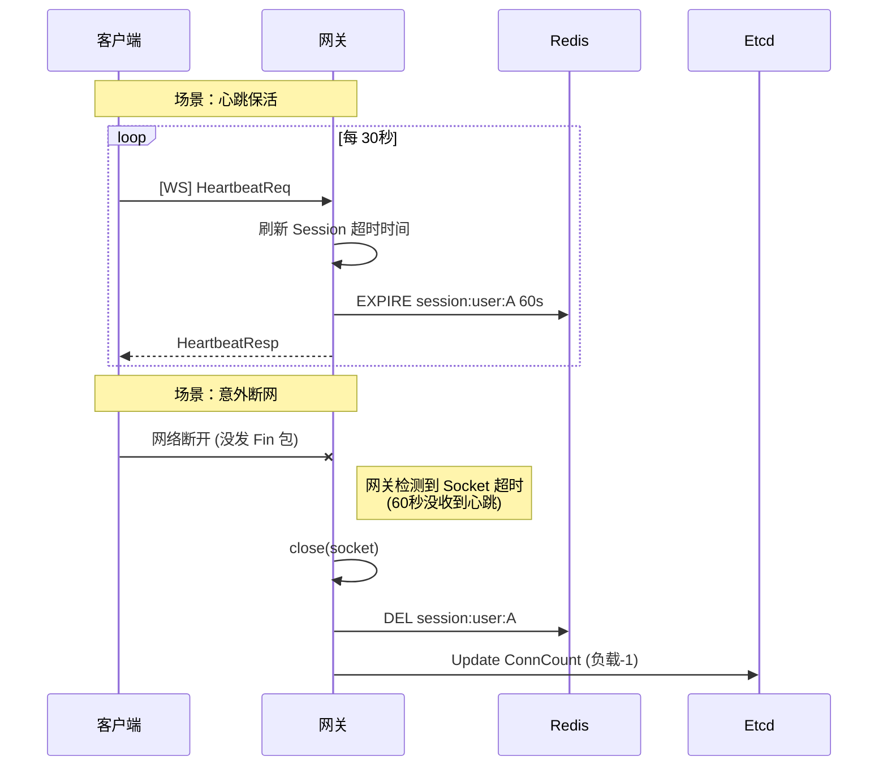

# 项目目录结构

## 根目录概览

```

im-server/

├── cmake/                  # 自定义 CMake 模块 (如 FindMySQL.cmake)

├── configs/                # 配置文件 (各服务的 yaml/json 配置)

├── deploy/                 # 部署相关 (Docker, Docker-compose)

├── docs/                   # 项目文档 (架构图, SQL 脚本, API 文档)

├── protos/                 # 原始 .proto 文件 (协议契约)

├── src/                    # 核心源代码

│   ├── common/             # 公共基础库 (日志, 工具, 数据库封装)

│   ├── protocol/           # 生成的 Protobuf/gRPC 代码封装

│   ├── gateways/           # 接入层服务 (ChatGW, FileGW)

│   ├── services/           # 逻辑层服务 (Auth, Msg, User...)

│   └── dispatch/           # 调度服务

├── tests/                  # 单元测试与集成测试

├── third_party/            # 第三方库 (如未通过包管理器安装)

├── .gitignore

├── CMakeLists.txt          # 根构建文件

└── README.md

```

## `src/` 源码目录详解

  

这里体现了**分层架构**的思想。

### A. `src/common/` (基础设施工厂)

所有服务都依赖的“轮子”，严禁包含业务逻辑。

  

```

src/common/

├── cmake/                  # 该模块的 CMakeList

├── base/                   # 基础类型定义 (Snowflake ID生成, 时间工具)

├── config/                 # 配置加载器 (解析 yaml/json)

├── database/               # 数据库封装

│   ├── mysql/              # MySQL 连接池封装

│   └── redis/              # Redis 连接池封装

├── log/                    # 日志封装 (基于 spdlog)

├── network/                # 网络基础类 (基于 Boost.Asio 的 TCP/WS 封装)

└── rpc/                    # gRPC 客户端/服务端基础封装 (Redis 注册/发现逻辑)

```

  

### B. `src/protocol/`

这里存放由 `protos/` 目录下的 `.proto` 文件生成的 C++ 代码，并编译成静态库 `im_proto_lib` 供其他服务链接。

```

src/protocol/

├── pb/                     # protoc 生成的 .pb.h 和 .pb.cc

│   ├── im_protocol.pb.h

│   └── im_internal.pb.h

├── CMakeLists.txt

└── protocol_manager.h      # 简单的协议解析/序列化帮助类

```

### C. `src/gateways/` (接入层)

  

```

src/gateways/

├── chat_gateway/           # 聊天/信令网关

│   ├── main.cpp

│   ├── server.h/cpp        # WebSocket Server 实现

│   ├── session.h/cpp       # 会话管理 (Session)

│   └── router.h/cpp        # 将 CmdID 路由到 gRPC Client

└── file_gateway/           # 文件传输网关

    ├── main.cpp

    ├── transfer_server.h   # TCP 二进制流 Server

    └── file_manager.h      # 磁盘读写与零拷贝处理

```

### D. `src/services/` (逻辑层微服务)

每个服务是一个独立的进程，目录结构高度相似。

```

src/services/

├── auth_server/            # 认证服务

│   ├── main.cpp

│   ├── service_impl.h/cpp  # gRPC Service 实现 (Login, Verify)

│   └── model/              # 数据库操作 (DAO)

├── msg_server/             # 消息服务 (核心)

│   ├── main.cpp

│   ├── service_impl.h/cpp  # SendMsg, SyncMsg 实现

│   ├── msg_storage.h       # 消息落库逻辑 (MySQL Timeline)

│   └── push_manager.h      # 消息推送逻辑 (Redis Session查找 -> Gateway)

├── user_server/            # 用户与关系服务

│   ├── main.cpp

│   ├── service_impl.h/cpp

│   └── relation_model.h    # 好友关系链 DB 操作

└── file_meta_server/       # 文件元数据服务

    ├── main.cpp

    └── task_model.h        # 文件任务 DB 操作

```

### E. `src/dispatch/` (调度入口)

  

```

src/dispatch/

├── main.cpp

├── http_server.h/cpp       # Boost.Beast HTTP Server

└── load_balancer.h         # 负载均衡策略 (从 Redis 拉取数据)

```

  

---

  

## 3. 数据库与脚本目录 (`docs/sql`)

```

docs/sql/

├── schema.sql              # 汇总的建表语句

├── 01_init_user.sql        # 用户模块表

├── 02_init_msg.sql         # 消息模块表

└── 03_init_group.sql       # 群组模块表

```

  

---

  

## 4. 部署目录 (`deploy/`)

```

deploy/

├── docker-compose.yml      # 一键启动所有服务

├── Dockerfile.gateway      # 网关镜像构建

├── Dockerfile.service      # 逻辑服务通用构建

└── config/                 # 挂载到容器内的配置文件

    ├── gateway.yaml

    └── microservices.yaml

```

  

# 测试体系规划

## 测试目录结构调整

我们需要在根目录的 `tests/` 下进行分层规划，将单元测试和集成测试分开。

  

```

im-server/

├── tests/

│   ├── CMakeLists.txt          # 测试工程构建脚本

│   ├── common/                 # 公共库测试 (Utils, Config, Log)

│   ├── protocol/               # 协议解析测试 (Pack/Unpack)

│   ├── mock/                   # 存放所有的 Mock 类 (模拟 DB, 模拟 RPC Stub)

│   │   ├── mock_db_conn.h      # 模拟数据库连接

│   │   └── mock_rpc_stub.h     # 模拟 gRPC 客户端

│   ├── services/               # 业务逻辑测试

│   │   ├── auth_test.cpp       # 认证逻辑测试

│   │   ├── msg_test.cpp        # 消息核心逻辑测试

│   │   └── user_test.cpp       # 关系链逻辑测试

│   └── integration/            # 集成测试 (需要真实 Docker 环境)

│       └── api_flow_test.cpp   # 模拟客户端发包的全链路测试

```

  

## 详细测试用例规划

  

为了确保系统可靠，需要覆盖以下模块。按照 **"先测工具，再测逻辑，最后测接口"** 的顺序执行。

### A. 基础组件测试

**目标**：确保底层的“轮子”是圆的，否则上层业务会随机崩溃。

  

|**模块**|**测试点 (Test Case)**|**预期结果 (Expectation)**|**备注**|

|---|---|---|---|

|**Snowflake ID**|**单调递增性**|连续生成 1000 个 ID，后一个必须大于前一个|核心|

|**Snowflake ID**|**并发唯一性**|开启 10 个线程同时生成 ID，存入 Set，Set 大小应等于总生成数|防止重复|

|**Config Loader**|**正常加载**|读取 `config.yaml`，能正确获取 IP、Port、DB 密码||

|**Config Loader**|**缺省/异常**|文件不存在或字段缺失时，应抛出异常或使用默认值，不应 Crash||

|**Thread Pool**|**任务执行**|提交 100 个简单的加法任务，最终结果累加正确||

|**Connection Pool**|**连接复用**|获取连接 -> 归还连接 -> 再获取，应该是同一个对象 (或状态重置)|针对 MySQL/Redis|

  

### B. 协议层测试

**目标**：确保封包、拆包、序列化逻辑正确，防止缓冲区溢出。

  

|**模块**|**测试点**|**预期结果**|

|---|---|---|

|**Packet Header**|**Encode/Decode**|将 Header 结构体转为 `char*` 再转回，字段值（Magic, CmdID, Len）一致|

|**Protobuf**|**序列化**|填充 `MsgSendReq`，序列化后反序列化，内容 `content` 和 `receiver_id` 必须一致|

|**Magic Check**|**非法包拦截**|修改包头的 Magic 为 `'X','X'`，解析函数应返回 `False` 或抛错|

|**Length Check**|**包体长度不符**|Header 里的 Length 写 100，实际 Body 只有 10 字节，解析器应报错|

  

### C. 业务逻辑层测试

**策略**：这里**不要**连接真实的数据库或 Redis，而是使用 **GoogleMock** 模拟 DAO 层和 RPC 调用。

#### (1) 认证服务

- **依赖 Mock**：`MockUserDAO` (模拟查数据库密码)

- **测试用例**：

    1. **Login_Success**: Mock DAO 返回正确的 Password Hash -> 调用 Login -> 返回 Success + Token。

    2. **Login_WrongPassword**: Mock DAO 返回正确 Hash，输入错误密码 -> 返回 Fail。

    3. **Login_UserNotFound**: Mock DAO 返回空 -> 返回 UserNotFound 错误。

    4. **Token_Verify**: 生成一个 Token，立即验证应通过；篡改 Token 一位，验证应失败。

#### (2) 消息服务

- **依赖 Mock**：`MockMsgStorage` (MySQL), `MockRedis` (Session/Seq), `MockGatewayStub` (推送)

- **测试用例**：

    1. **SendMsg_Store**: 调用 SendMsg，验证 `MockMsgStorage::Insert` 被调用了一次 (参数匹配)。

    2. **SendMsg_Push**: 模拟接收者在线 (MockRedis 返回 IP)，验证 `MockGatewayStub::PushNotify` 被调用。

    3. **SendMsg_Offline**: 模拟接收者离线 (MockRedis 返回 Null)，验证 `PushNotify` **未被**调用。

    4. **SyncMsg_Range**: 输入 `LocalSeq=10`, Mock DAO 返回 Seq 11~15 的列表，验证返回的 List 包含这 5 条。

#### (3) 用户关系服务

- **依赖 Mock**：`MockRelationDAO`

- **测试用例**：

    1. **AddFriend_Normal**: A 加 B，验证 DAO 插入了两条记录 (A->B, B->A)。

    2. **AddFriend_Duplicate**: 模拟 DAO 返回“已存在”，验证业务层返回“已经是好友”。

    3. **GetFriendList**: 验证返回的列表能正确映射 Protobuf 结构。

### D. 网关层测试

**目标**：测试连接管理和路由分发（不涉及真实网络 IO，主要测 SessionManager）。

  

|**模块**|**测试点**|**预期结果**|

|---|---|---|

|**Session Manager**|**Add/Remove**|建立连接加入 Map，断开移除 Map，统计计数正确|

|**Session Manager**|**Find**|根据 UserID 能找到对应的 Session 指针|

|**Router**|**Cmd 分发**|输入 CmdID `0x2001`，验证是否调用了 `HandleMsgSend` 函数|

  

---

  

## 集成测试

这是**黑盒测试**，通常在 CI/CD 流程中通过 Docker Compose 启动真实环境后运行。

- **测试环境**：真实的 MySQL, Redis 容器。 

- **工具**：编写一个 C++ 测试客户端，或者使用 Python 脚本。

- **场景**：

    1. **注册登录流程**：Client 连接 -> 发送 Login -> 收到 LoginResp。

    2. **消息回环**：Client A 发送 "hello" -> Client B (在这个测试脚本中模拟) 收到 PushNotify -> Client B 拉取 -> 收到 "hello"。

    3. **断线重连**：Client A 断开 Socket -> 重新连接 -> 再次 Login -> 状态恢复。