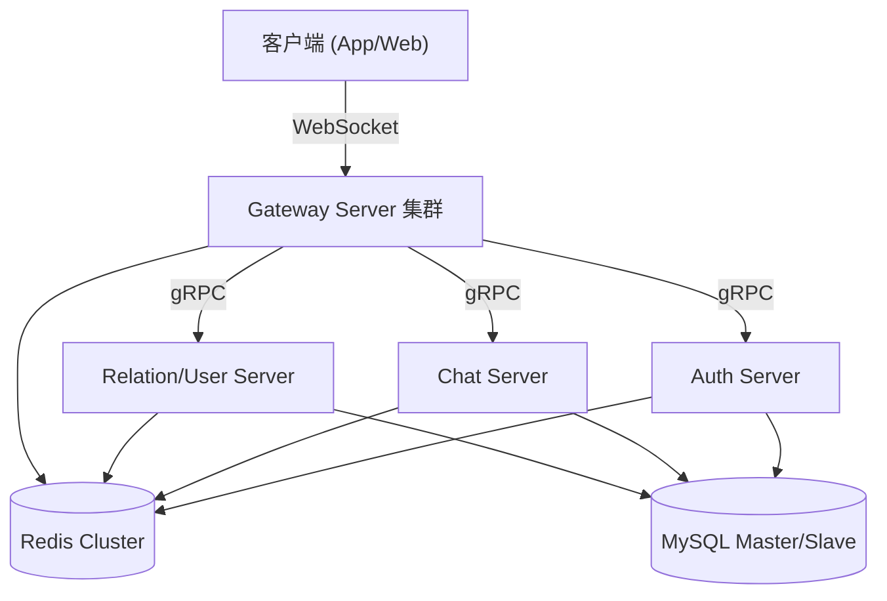

# TinyIM - 高性能分布式即时通讯系统

TinyIM 是一个基于 C++20 的高性能分布式即时通讯系统，采用微服务架构设计，支持水平扩展、高并发和高可用。

## 🏗️ 系统架构

系统主要由以下四个微服务组件构成，通过 gRPC 进行通信，Redis 作为服务注册中心和消息总线，MySQL 作为持久化存储。



### 组件说明
- **Gateway Server**: 网关服务。维护与客户端的长连接 (WebSocket)，负责消息推送、协议解析、服务路由和负载均衡。支持心跳监测和连接保活。
- **Auth Server**: 认证服务。负责用户注册、登录、Token 生成与校验。实现单设备/多设备互踢逻辑。
- **Chat Server**: 聊天服务。处理单聊、群聊消息的存储、同步 (Timeline 模型) 和离线消息拉取。
- **Relation (User) Server**: 关系服务。管理用户资料、好友关系申请与维护、群组创建与成员管理。

## 🛠️ 技术栈

- **编程语言**: C++20
- **网络框架**: Boost.Asio, Boost.Beast (WebSocket/HTTP)
- **RPC 框架**: gRPC + Protobuf
- **数据库**: MySQL 8.0 (主从复制，读写分离)
- **缓存/消息队列**: Redis 6.0 (Pub/Sub, Hash, Set)
- **日志**: spdlog (异步高性能日志)
- **构建工具**: CMake
- **容器化**: Docker & Docker Compose
- **测试**: Google Test (gtest)

## ✨ 主要功能

1.  **用户认证**
    - 注册与登录
    - 多端登录管理 (Token 机制)
    - **同端互踢**: 检测到同一设备类型重复登录时，自动剔除旧连接并发送通知。

2.  **好友关系**
    - 申请添加好友 (支持附带备注)
    - 同意/拒绝申请
    - 好友列表获取
    - **实时推送**: 好友申请实时推送到在线客户端。

3.  **单聊 (P2P)**
    - 文本消息发送与接收
    - 离线消息存储
    - 消息漫游 (Sync 机制)

4.  **群聊 (Group)**
    - 创建群组、加入群组
    - 群消息广播 (写扩散模型)
    - **消息同步**: 统一的 Timeline 能够拉取单聊和群聊的历史消息。
    - **群通知**: 用户加入群组时，全员收到系统通知。

5.  **系统特性**
    - **心跳保活**: 应用层心跳机制，自动检测并断开僵尸连接。
    - **负载均衡**: 简单的 Round-Robin 策略分配 Gateway 节点。
    - **优雅关闭**: 服务端支持优雅断开连接流程。
    - **读写分离**: 关键业务查询走从库，写入走主库。

## 🚀 快速开始

### 前置条件
- Docker & Docker Compose
- Linux/Windows (WSL2) 环境

### 编译与运行

1. **启动基础设施 (MySQL, Redis)**
   ```bash
   cd infra/docker
   ./setup.sh
   docker-compose up -d
   ```

2. **编译微服务**
   ```bash
   mkdir build && cd build
   cmake ..
   make -j4
   ```

3. **运行服务**
   使用提供的脚本一键启动所有服务：
   ```bash
   cd ..
   infra/scripts/start_services.sh
   # 或者手动启动:
   # ./build/auth_server
   # ./build/chat_server
   # ./build/user_server
   # ./build/gateway_server
   ```

4. **运行集成测试**
   确保所有服务都在运行状态，然后执行：
   ```bash
   cd build
   ./tests/integration_test
   ```

## 📂 目录结构

- `src/`: 源代码
  - `gateway/`: 网关服务
  - `auth_server/`: 认证服务
  - `chat_server/`: 聊天服务
  - `user_server/`: 关系与用户服务
  - `common/`: 公共库 (DB池, Redis客户端, 配置等)
- `protos/`: gRPC Protobuf 定义
- `sql/`: 数据库初始化脚本
- `tests/`: 集成测试代码
- `infra/`: 基础设施配置 (Docker, Scripts)
- `docs/`: 开发文档与验证报告

## 📝 贡献
本项目仅供学习与研究使用。
